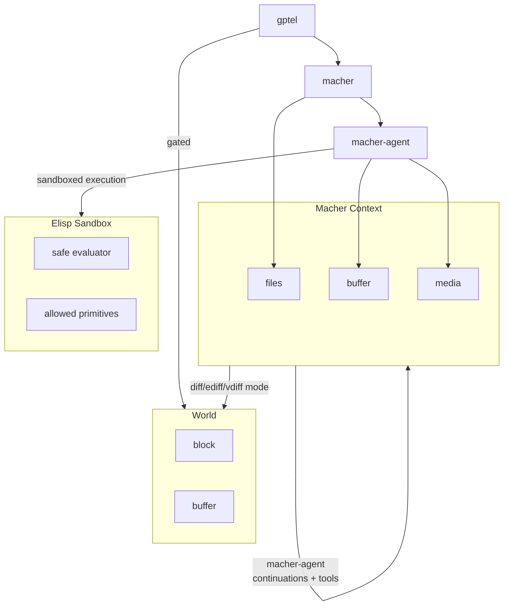

# macher-agent

An Emacs-native LLM agent harness with isolated sandboxing, asynchronous sub-agent orchestration, and a strict three-tier virtual file system. `macher-agent` is tuned to multiplex dozens of agents in an active Emacs instance and keep feature parity with mainstream harnesses including the approach to memory, [programmatic tool calling](https://platform.claude.com/cookbook/tool-use-programmatic-tool-calling-ptc), tail call optimisation of large agent graphs etc. This is all done exclusively in elisp with direct LLM APIs (through gptel) and without depending on any other harness/middleware (no SDKs, ACP etc.).

https://github.com/user-attachments/assets/35908782-ee2b-4243-8b93-ad8381cfee5c

macher-agent is driven by [gptel](https://www.google.com/search?q=https://github.com/karthink/gptel) (meaning you still have access to all of the gptel ecosystem) and integrates with [macher](https://www.google.com/search?q=https://github.com/kmontag/macher). Please review their respective repositories for further video examples of what can be done when all are used in tandem.

Please review the [wiki](https://www.google.com/search?q=https://github.com/elij/macher-agent/wiki) for advanced use cases:
[Self-evolving](https://www.google.com/search?q=https://github.com/elij/macher-agent/wiki/Example-Self%25E2%2580%2590Evolving-Agent-(Voyager-Pattern)) agents, sub-agent [recursion](https://www.google.com/search?q=https://github.com/elij/macher-agent/wiki/Example-subagent-recursion-(Kimi-Agent-Swarm-Pattern)), [deterministic pipelines](https://www.google.com/search?q=https://github.com/elij/macher-agent/wiki/Example-Graph%25E2%2580%2590Based-Agent-Workflows-(LangGraph-Pattern)), and [more](https://www.google.com/search?q=https://github.com/elij/macher-agent/wiki).

## Emacs-native LLM orchestration

* The harness allows agents to solve problems in a sanbdox uninterrupted prior to providing a unified diff. In contrast to per tool permission dialogues.
* The harness provides strict sandboxing, allowing you to run untrusted code or commands inside secure, ephemeral directory and Emacs Lisp environments.
* Non-blocking multiplexing lets you orchestrate multiple sub-agents and operations concurrently without leaving your Emacs session or resorting to a terminal interface.
* Because there are no non-elisp dependencies, the core harness is built purely in Emacs Lisp, making every hook, FSM transition, and tool call completely hackable and customisable.

## Changes in gptel and macher when enabled

### gptel

* State isolation restricts the gptel from modifying global setting state to prevent race conditions during parallel execution, managing all customisations via buffer-local parameters or system defaults.
* Automatic preset composition transparently aggregates system prompts and binds specified models to local execution contexts.
* Tag conversion transforms inline preset tokens (for example, `@compact`) submitted without further prompt text directly into user directives.
* Base64 media transfer in addition to  physical-disk absolute path reading.  With a base64 string reader to inject images or files directly into the active session's pending media queue without polluting the Emacs interface.

### macher

* VFS targeting ensures workspace modification tools operate directly on the memory-based Virtual File System (VFS).
* VFS persistence caches edits in virtual memory so they persist across agent turns until they are explicitly cleared or committed by the user.
* Asynchronous querying enables search and directory utilities to automatically query hydrated virtual structures, overlaying memory edits seamlessly.
* Sub agent in the same workspace  get a sub workspace VFS that is merged after edits are completed. Tools like `wait_for_vfs_semaphore` are needed to operate at the global VFS level.
* The VFS can support file and buffers edits including `macher` generating patches for buffers.

## Table of contents

1. [Core concepts and architecture](#core-concepts-and-architecture)
2. [Typical harness users transitioning to Emacs](#typical-harness-users-transitioning-to-emacs)
3. [Asynchronous execution of processes, Lisp, and sub-agents](#asynchronous-execution-of-processes-lisp-and-sub-agents)
4. [Quick start and installation](#quick-start-and-installation)
5. [Tool creation and the sandbox](#tool-creation-and-the-sandbox)
6. [Runtime sandboxing](#runtime-sandboxing)
7. [Agent skills and registration](#agent-skills-and-registration)
8. [Advanced context](#advanced-context)
9. [Orchestrating workflows](#orchestrating-workflows)
10. [Lifecycle hook mapping matrix](#lifecycle-hook-mapping-matrix)
11. [Command and tool reference](#command-and-tool-reference)

## Core concepts and architecture



* The LLM and interface layer (`gptel`) manages the conversational buffers, stream parsing, and finite state machine transitions.
* The agent orchestrator (`macher-agent`) intercepts LLM outputs, validates tool calls, manages sandboxed code execution, and coordinates background sub-agents.
* The virtual file system (`macher`) tracks edits in hidden memory buffers as VFS tuples, acting as an isolated buffer overlay.

The agent never modifies physical files on disk directly. Instead, all file modifications are applied to the memory-based VFS. At the end of a turn, `macher`  is responsible for the  patch-building process, separating edits into virtual and physical contexts. These are formatted as clean patches in `diff-mode` buffers, allowing you to review and partially or fully apply changes to your physical files.

## Typical harness users transitioning to Emacs

If you are transitioning from CLI-based agent tools like Claude Code, `macher-agent` offers a native, and integrated alternative directly inside Emacs.

### Terminal prompts vs native buffers

Instead of running an agent inside an isolated terminal window, `macher-agent` turns any Emacs buffer into an interactive conversation. You can write code, run compilers, and converse with the agent in parallel (including many agents across many workspaces operating at the same time).

### Interactive diffs over automatic file modification

Typical harness modifies your disk files directly (with permission gates), which often requires you to manually undo undesirable modifications using Git. `macher-agent` utilises the Macher VFS to queue modifications in memory. This allwos for the patch you're eventually presented to have gone through several cycles of validation. You are presented with interactive, editable diffs that you can modify, accept, or reject hunk-by-hunk before a single byte touches your disk (diff-mode can easily changed to your preferred workflow including using magit-diff-wash-diffs).

### Slash commands mapping

The interactive slash commands used in typical harnesses map directly to Emacs functions and tool interactions:

| Command | Emacs / Macher-agent equivalent | Description |
| --- | --- | --- |
| `/btw` | `M-x macher-agent-inject-thought` | Inject manual guiding instructions mid-flight while the agent is running. |
| `/rewind` | `M-x macher-agent-branch-chat` | Branch the conversation from a selected point to explore an alternative path. |
| `/compact` | Prompt-level skill selection | Prune the active conversation state to optimise token usage. |
| `/plan` or `/goal` | presets (gptel or SKILL.md-based) | Leverage a structured planning skill to coordinate task implementation. |
| `/statusline` | gptel header-line | Native, real-time visual tracking of active LLM and sub-agent processes. |

### Execution harness scope and evaluations

For users transitioning from comprehensive enterprise systems, the boundary of this framework is clearly defined. The `macher-agent` package is strictly a runtime execution harness. While it provides the environment state (via the virtual file system) and the execution tools, it does not include automated evaluation environments, benchmark datasets, LLM-as-a-judge scoring rubrics, or metrics tracking (such as Pass@k). While the package runs the execution loop and manages agent turns, you will need to construct your own custom Emacs Lisp testing harness if you require automated benchmark evaluations.

## Asynchronous execution of processes, Lisp, and sub-agents

The orchestrator utilises non-blocking execution models across all tool families. Scaling up to dozens of subagents over a number of isolated workspaces.

* Operating system processes that return a process response (such as compilers, test runners, or sandboxed shell executors) run asynchronously using background process sentinels. You can continue editing other files, navigating directories, or conversing with other buffers while the background process completes.
* Asynchronous Lisp and callbacks handle operations that require conditional waiting. The evaluator suspends the agent's turn, scheduling a callback closure on a timer or hooking into a specific event (such as `macher-agent-context-mutated-hook`), and resumes the agent continuation only when the condition is satisfied.
* Parallel sub-agents are spawned and executed by a background event-bus orchestrator. A parent agent can dispatch independent tasks to multiple sub-agents in parallel and continue its turn immediately, accumulating sub-agent outputs as they finish.

## Quick start and installation

`macher-agent` requires `macher`, `gptel`, and the system-level utility `rsync`.

```elisp
(use-package gptel
  :defer t
  :config (require 'macher))

(use-package macher
  :defer t)

(use-package macher-agent
  :after (gptel macher)
  :bind (("C-c m" . macher-agent-inject-thought))
  :custom
  ;; Configure your custom skills and tool scripts directory:
  (macher-agent-skill-directories (list (expand-file-name "skills" user-emacs-directory)))
  :config
  ;; Initialise skills and tools into registries
  (macher-agent-initialize-skills))

;; If you want to leverage the optional default skill pack:
(use-package macher-agent-skills
  :after macher-agent)

```

Initialise your workspace

```console
git init
```

And run `gptel` within this new workspace.


## Tool creation and the sandbox

Define custom tools declaratively using the `macher-agent-make-tool` macro. This DSL handles errors, formats responses, and automatically extracts the asynchronous callback function from either the front or the back of the argument list depending on the caller environment.

Your `:command-fn` receives the parsed argument payload. If the function is configured to accept more parameters, it will receive the active VFS `context` and the workspace `root` path.

### Examples

An asynchronous process execution tool can be set up to run tasks in the background:

```elisp
(macher-agent-make-tool macher-agent-cargo-check-tool
  "Run 'cargo check' in the background to verify the project."
  :category "rust"
  :args nil
  :command-fn (lambda (_payload)
                (make-macher-agent-process-response :payload "cargo check </dev/null 2>&1"))
  :success-fn (lambda (output)
                (if (string-match-p "error\\[" output)
                    output
                  (concat "SUCCESS: The code compiled perfectly with no errors.\n\n=== COMPILER OUTPUT ===\n" output))))

```

An Emacs Lisp VFS tool can be created to interact with the virtual file system memory directly:

```elisp
(macher-agent-make-tool macher-agent-custom-read-tool
  "Read a file from the virtual file system memory."
  :category "workspace"
  :args '((:name "path" :type string :description "File path relative to root"))
  :command-fn (lambda (payload context _root)
                (let* ((path (plist-get payload :path))
                       (content (macher-agent-context-read context path)))
                  (if content
                      (make-macher-agent-lisp-result-response :payload content)
                    (error "File not found in the virtual file system: %s" path)))))

```

## Runtime sandboxing

`macher-agent` enforces security boundaries and halts unauthorised actions before execution occurs.

The Emacs Lisp sandbox executes LLM generated Lisp code without exposing your local file system or global Emacs variables to risk.

Only pure functional primitives as safe by default. Any host operations or external commands must be explicitly declared and authorised.

### Safe block

This example defines and calls a local volume calculation function while safely shadowing variables:

```elisp
(let ((safe-program
       '(progn
          (defun calculate-volume (width height depth)
            (* width height depth))
          (let ((calculate-volume 999))
            (message (concat "Volume is: " 
                    (number-to-string (calculate-volume 5 10 2))))))))
  (macher-agent-sandbox-run safe-program '(number-to-string message)))

```

### Unsafe block

In this example, trying to call a restricted host primitive results in an error, which prevents the malicious program from reading sensitive files:

```elisp
(let ((malicious-program
       '(insert-file-contents "/etc/passwd")))
  (condition-case err
      (macher-agent-sandbox-run malicious-program nil)
    (error (message "Execution halted: %S" err))))

```

## Agent skills and registration

### Programmatic tool calling primitives

Agent skills defined via `SKILL.md` files accept an optional `ptc-primitives` list in their YAML frontmatter (for example, `ptc-primitives: ["spawn_subagent", "delegate_tasks_to_subagents"]`).

PTC allows an agent to chain a number of tool uses in a single tool call (including with intermediate calulations in elisp). This speeds up agent activitity by allowing all calls to operate without a round trip and is token efficient. The sandbox yields to update the gptel UI with the progress of each tool call.

PTC relies on ptc-payloads which are created with `macher-agent-make-tool` and unfortunately don't work with gptel tools as they return natural language rather than unlying returned primitives.

```elisp
(:name "ptc_execution" :args (:script "(let* ((fr_agent (spawn-subagent \"France Expert\" nil))
       (es_agent (spawn-subagent \"Spain Expert\" nil))
       (results (delegate-tasks-to-subagents
                 (list
                  (list :buffer_name fr_agent :instructions \"What is the capital of France?\")
                  (list :buffer_name es_agent :instructions \"What is the capital of Spain?\")))))
  (format \"Response from France Expert (%s): %s\\nResponse from Spain Expert (%s): %s\"
          fr_agent
          (car results)
          es_agent
          (cadr results)))"))

Response from France Expert (France Expert): #s(macher-agent-tool-response nil success The capital of France is Paris. nil France Expert)
Response from Spain Expert (Spain Expert): #s(macher-agent-tool-response nil success The capital of Spain is Madrid. nil Spain Expert)
```

## Advanced context

* Interactive steering allows for injecting thoughts mid-flight. If the agent is executing a long-running process in the background, you can use `M-x macher-agent-inject-thought`. Your guidance will be queued and automatically bundled into the next turn once the active process finishes.
p
## Orchestrating workflows

Workflows can be driven interactively, programmatically, or autonomously. Typical execution harnesses conceptualise these operations as specific multi-agent topologies and architectural patterns.

### Hub-and-spoke (Kimi agent swarm pattern)

By utilising the `spawn_subagent` and `submit_task_result` tools, a primary agent can construct deeply nested trees of sub-agents. This encapsulating topology delegates granular work downstream and aggregates the results back up, preventing root-layer context window saturation and preserving general focus.

### Dependency waves

Parallel and staged pipeline execution can be structured around file-based triggers. Using the `wait_for_vfs_semaphore` tool, sub-agents can autonomously suspend their processing until prerequisite datasets or outputs are written to the virtual file system by other concurrent workers, resuming only when the required virtual files are successfully created or modified.

### Self-evolving agents (Voyager pattern)

To facilitate open-ended problem solving and dynamic capability accretion, an agent can autonomously author and acquire its own skills. The agent writes a new `SKILL.md` file containing the YAML frontmatter and instructional payload to the skill directory using `write_file_in_workspace`, and immediately spawns a fresh sub-agent equipped with that newly engineered capability.

## Lifecycle hook mapping matrix

This matrix defines how the conceptual lifecycle events of an agentic process map technically down into the `macher-agent` implementation:

| Conceptual event | gptel integration | Macher VFS concept | Macher-agent hook / mechanism |
| --- | --- | --- | --- |
| `SessionStart` | `gptel-mode-hook` | `macher-init-session-hook` | Handled at workspace initialisation. |
| `UserPromptSubmit` | `gptel-pre-response-functions` | `macher-before-send-hook` | Handled at request dispatch. |
| `PreToolUse` | Intercept via tool wrapper | `macher-pre-execute-tool-hook` | `macher-agent-pre-tool-use-hook` |
| `PermissionRequest` | Interactive custom wrappers | `macher-diff-review-hook` | `macher-agent-permission-request-hook` |
| `PostToolUse` | Callback return structure | `macher-post-execute-tool-hook` | `macher-agent-post-tool-use-hook` |
| `PostToolUseFailure` | Callback error handling | `macher-error-recovery-hook` | `macher-agent-post-tool-use-failure-hook` |
| `Stop` / `SubagentStop` | `gptel-post-response-functions` | `macher-post-response-hook` | Handled at task completion. |

## Command and tool reference

### Interactive commands

| Command | Description |
| --- | --- |
| `M-x macher-agent-add-buffer-to-scope` | Adds an existing Emacs buffer to the agent's active tracking list. |
| `M-x macher-agent-clear-context` | Clears all pending virtual memory and unsaved edits in the active workspace. |
| `M-x macher-agent-branch-chat` | Branches the current conversation into a new buffer, preserving prior context. |
| `M-x macher-agent-inject-thought` | Queues manual instructions to steer the agent during background executions. |
| `M-x macher-agent-apply-patch` | Evaluates and applies the proposed patch buffer to the physical disk. |
| `M-x macher-agent-insert-patch` | Inserts the workspace patch directly into the chat buffer. |
| `M-x macher-agent-apply-virtual-buffers` | Directly applies virtual edits to active Emacs buffers. |
| `M-x macher-agent-initialize-skills` | Scans directories and compiles all skills, presets, and tools into memory. |

### LLM tools reference

The system relies on two classes of tools: `macher` VFS Tools (the primary vehicle for workspace and file modification) and `macher-agent` Tools (for orchestration, parallel sub-agents, and advanced evaluations).

#### Macher VFS tools (primary file modification)

| Tool Name | Description |
| --- | --- |
| `read_file_in_workspace` | Retrieves the content of any file in the workspace. |
| `search_in_workspace` | Executes a regular expression search across all files in the workspace. |
| `list_directory_in_workspace` | Lists directory contents, showing files and structures recursively. |
| `edit_file_in_workspace` | Makes exact, bounded string replacements inside a workspace file. |
| `multi_edit_file_in_workspace` | Performs multiple exact string replacements sequentially inside a single file. |
| `write_file_in_workspace` | Creates a new file or overwrites an existing file in the workspace. |
| `move_file_in_workspace` | Moves, renames, or restructures files. |
| `delete_file_in_workspace` | Deletes a file from the virtual file system. |

#### Macher-agent tools (orchestration and auxiliary)

| Tool Name | Description |
| --- | --- |
| `spawn_subagent` | Spawns a new sub-agent buffer inheriting LLM configurations and the parent's virtual state. |
| `delegate_tasks_to_subagents` | Dispatches specific instructions to multiple sub-agents asynchronously and gathers their results. |
| `execute_subagents` | Initiates sub-agent task loops in a fire-and-forget, non-blocking background process. |
| `submit_task_result` | Submits final outputs from a sub-agent worker back to the parent orchestrator. |
| `mark_self_for_reap` | Flags the current sub-agent buffer for automatic termination once its tasks are complete (only sub agents can self reap). |
| `wait_for_vfs_semaphore` | Suspends agent processing asynchronously until a specified file is created or modified on the VFS (operates at the global VFS level). |
| `read_media_in_workspace` | Reads a media resource (for example, an image) and packages it as base64 for pre-flight injection. |
| `list_buffers_in_workspace` | Lists all active buffers in the agent's current scope. |
| `read_buffer_in_workspace` | Retrieves lines or regions from active, scoped Emacs buffers with optional line numbering. |
| `write_buffer_in_workspace` | Proposes new contents for a live Emacs buffer, creating a review patch. |
| `multi_edit_buffer_in_workspace` | Sequentially applies multiple string replacements to a live Emacs buffer. |
| `commit_buffer` | Bypasses patch review to append or overwrite a live Emacs buffer and synchronise VFS memory immediately. |
